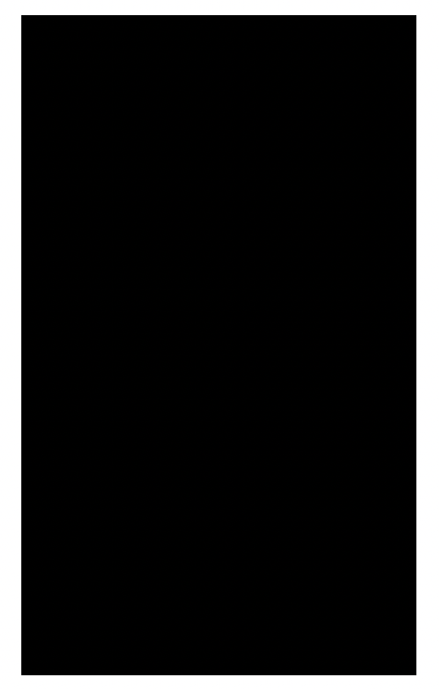
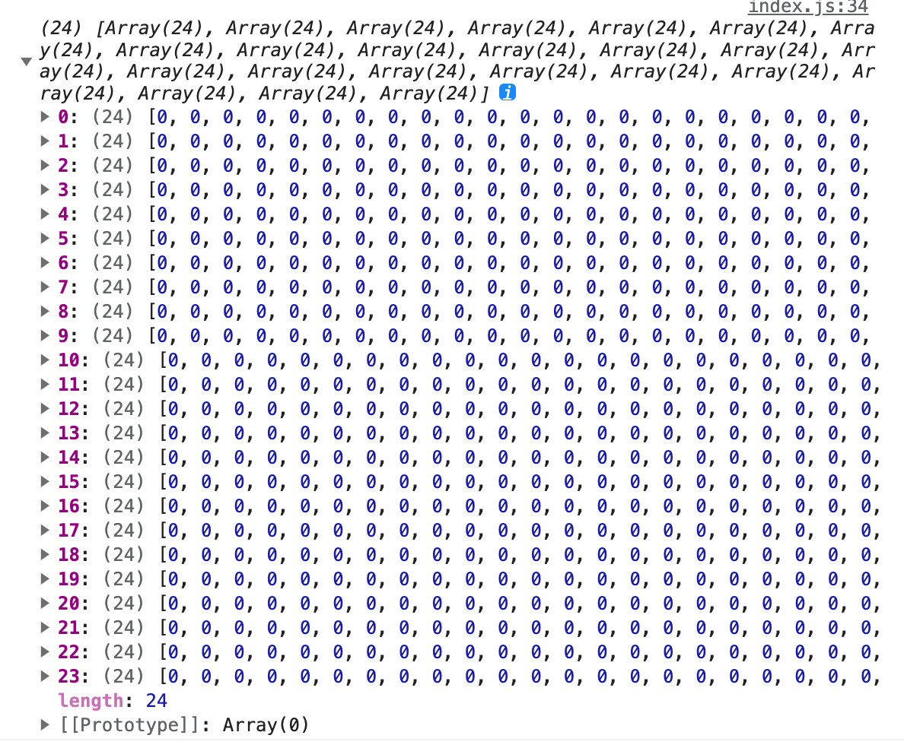
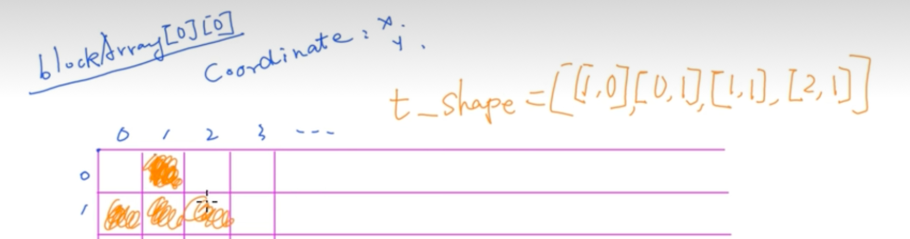
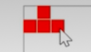
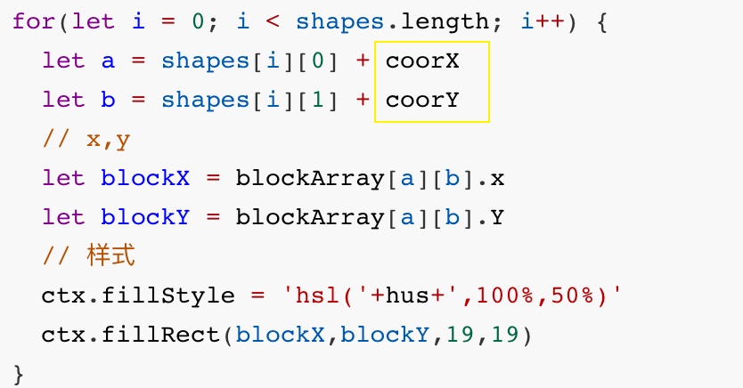
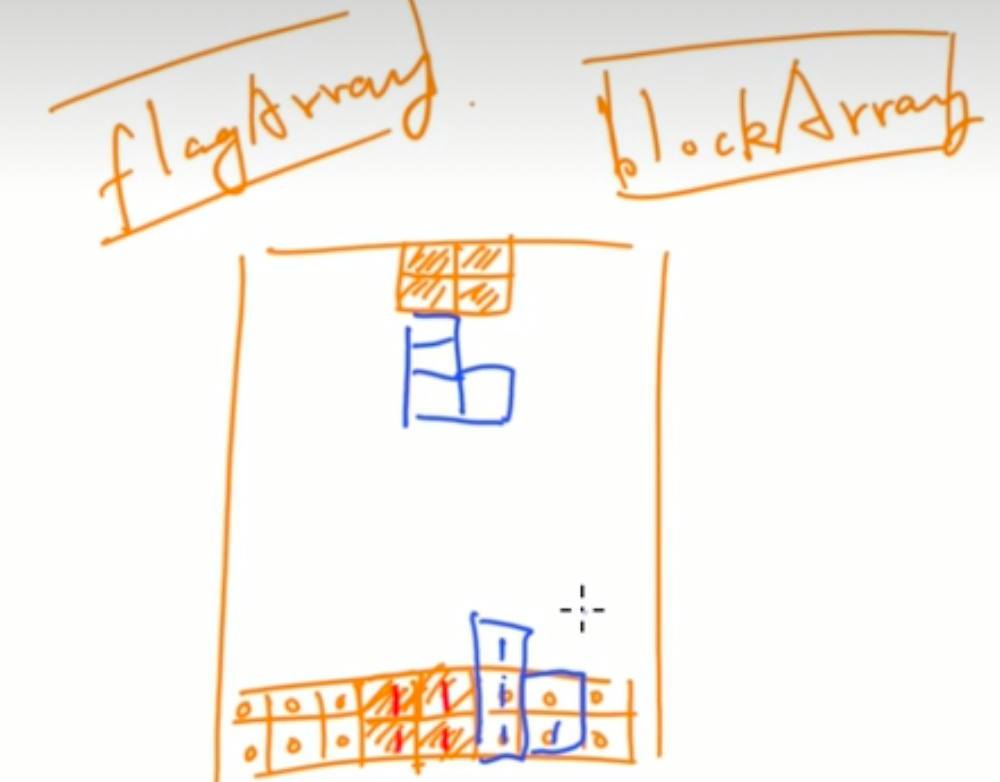
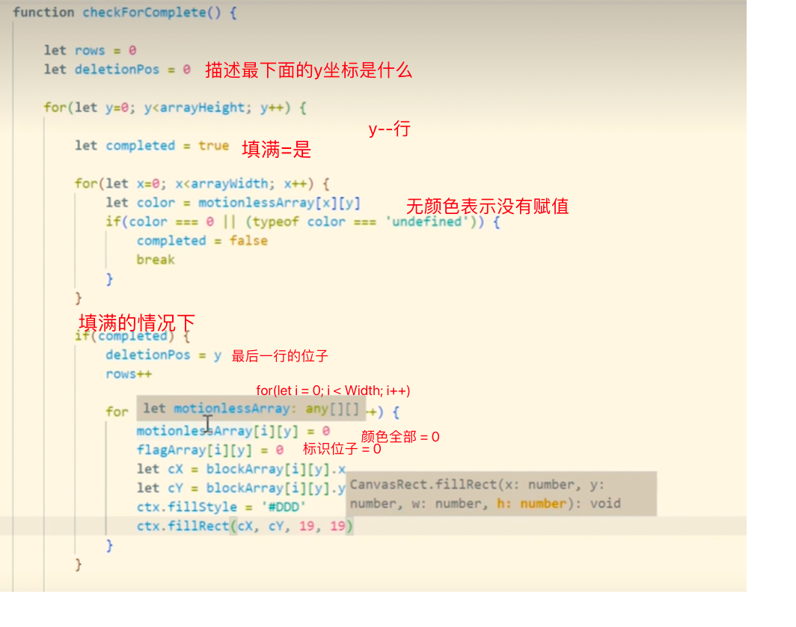

## 01-初始化canvas--生成游戏区域

- ##### 样式



- #### 代码

  ```js
  let canvas = document.getElementById('canvas') // 画布
  let ctx = canvas.getContext('2d') // 上下文对象
  
  
  /**
   * 基础配置
   */
  
  // 整体容器宽高
  canvas.width = 288
  canvas.height = 480
  
  // 每个格子宽高
  let Width = 24
  let Height = 24
  
  // 图形
  let curShape
  
  // 初始图形所在位子
  let coorX = 5
  let coorY = 0
  
  // 框的样式定义
  ctx.fillStyle = 'black'
  ctx.fillRect(0, 0, canvas.width, canvas.height)
  ctx.strokeRect(0, 0, canvas.width, canvas.height)
  
  let blockArray = [...Array(Width)].map(e => Array(Height).fill(0))
  console.log(blockArray)
  ```
  
  

## 02-给每个二维数组进行赋值(记录坐标)--对象

```js
// 坐标类
class Coordinate {
  constructor(x,y) {
    this.x = x
    this.y = y
  }
}

// 监听调用：动画内容完全加载完
document.addEventListener('DOMContentLoaded',initCanvas)
// 初始
function initCanvas () {
  createBlockArray()
  drawShape()
}
//createBlockArray()
//console.log(blockArray)

function createBlockArray() {
  let i = 0, j = 0
  for(let y = 5; y < canvas.height; y += 20) {
    for(let x = 5; x <= canvas.width; x += 20) {
      blockArray[i][j] = new Coordinate(x,y)
      i++
    } 
    j++
    i = 0
  }
}
```


## 03-绘制图形（七种）

- ### 绘制1个图形

  样式

  

  

  代码

  ```js
  /**
   * 初始化配置
   */
  let tbox = [[0, 0], [1, 0], [2, 0], [1, 1]] // T
  
  /**
   * 主逻辑
   */
  
  function drawShape() {
    for(let i = 0; i < tbox.length; i++) {
      let a = tbox[i][0]
      let b = tbox[i][1]
      // x,y
      let blockX = blockArray[a][b].x
      let blockY = blockArray[a][b].Y
      // 样式
      ctx.fillStyle = 'red'
      ctx.fillRect(blockX,blockY,19,19) 
    }
  }
  ```

- ### 绘制多个图形

  
  
  > ##### 随机生成索引值
  >
  > ```js
  > /**
  >  * 初始化配置
  >  */
  > let currentShape
  > let currentColor
  > /**
  >  * 主逻辑
  >  */
  > 
  > function randomShape() {
  >     // 随机选择拿到索引值
  >   let randomIndex = Math.floor(Math.random() * shapes.length)
  > 	let shapes = shapes[randomIndex]
  >   // 随机生成颜色
  >   currentColor =colors [randomIndex]
  >   currentShape = shapes
  > }
  > ```
  >
  > ##### 在指定初始位置（中间）
  >
  > ```js
  > /**
  >  * 基础配置
  >  */
  > 
  > // 初始图形所在位子
  > let coorX = 5
  > let coorY = 0
  > ```
  >
  > 
  
  ```  js
  
  /**
   * 初始化配置
   */
  
  // 初始图形所在位子
  let coorX = 5
  let coorY = 0
  
  // 七种图形
  let tu_box = [[1, 0], [0, 1], [1, 1], [2, 1]] // 土
  let y_box = [[0, 0], [1, 0], [2, 0], [3, 0]] // 一
  let z_box = [[1, 0], [2, 0], [0, 1], [1, 1]]// 反z
  let tian_box = [[0, 0], [0, 1], [1, 0], [1, 1]] // 田
  let l_box = [[0, 0], [0, 1], [1, 1], [2, 1]] // L
  let i_box = [[0, 1], [0, 0], [1, 0], [2, 0]]  // I一
  let t_box = [[0, 0], [1, 0], [2, 0], [1, 1]] // T
  
  // 放置同一个数组
  let shapes = [tu_box, y_box, z_box, tian_box, l_box, i_box, t_box]
  // 随机色
  // let hue = Math.random() * 360
  let colors = ['red','blue','orange','lime','teal','green']
  
  // 监听调用：动画内容完全加载完
  document.addEventListener('DOMContentLoaded',initCanvas)
  // 初始
  function initCanvas () {
    createBlockArray()
    randomShape()
    drawShape()
  }
  
  
  /**
   * 主逻辑
   */
  
  function shapes() {
   
    for(let i = 0; i < shapes.length; i++) {
      let a = currentShape[i][0] + coorX
      let b = currentShape[i][1] + coorY
      // x,y
      let blockX = blockArray[a][b].x 
      let blockY = blockArray[a][b].Y 
      // 样式
      ctx.fillStyle = currentColor
      ctx.fillRect(blockX,blockY,19,19) 
    }
  }
  
  function randomShape() {
      // 随机选择拿到索引值
    let randomIndex = Math.floor(Math.random() * shapes.length)
  	let shapes = shapes[randomIndex]
    // 随机生成颜色
    currentColor =colors [randomIndex]
    currentShape = shapes
  }
  ```
  


## 04-添加事件-移动图形

> ##### 04-1 移动图形
>
> ###### 本质：重新的生成图形

```js
// 监听调用：动画内容完全加载完
document.addEventListener('DOMContentLoaded',initCanvas)
// 初始
function initCanvas () {
  createBlockArray()
  randomShape()
  drawShape()
  
  
  // document.addEventListener('keydown',keyPress) // 键盘点击事件
  bindClick() // 调用点击事件
}

 /*
 *监听事件
*/
function bindClick (time) {
  // 左
  this.clickMoveLeft.onmousedown = (e) => {
    removeShapes()
    coorX--
    drawShape()
  }
  // 左
  this.clickMoveRight.onmousedown = (e) => {
    removeShapes()
    coorX++
    drawShape()
  }
}
```

> ##### 04-2 移除原用的图形
>
> ###### 修改背景色即可

```js
/**
 * 主逻辑
 */

function removeShapes() {
 
  for(let i = 0; i < shapes.length; i++) {
    let a = currentShape[i][0] + coorX
    let b = currentShape[i][1] + coorY
    // x,y
    let blockX = blockArray[a][b].x 
    let blockY = blockArray[a][b].Y 
    // 样式
    ctx.fillStyle = 'black'
    ctx.fillRect(blockX,blockY,19,19) 
  }
}
```


## 05-边界的检测

### 05-1 左右边界的检测

> - ##### 左右方向的检测
>
> 记录方向，才能统一写一个方法

```js
/**
 * 初始化配置
 */

let currentDirection

const DIRECTION = {
  NO:1,
  LEFT:2,
  RIGHT:3,
  DOWN:4 
}

/*
 *监听事件
*/
function bindClick (time) {
  // 左
  this.clickMoveLeft.onmousedown = (e) => {
    currentDirection = DIRECTION.LEFT //记录当前方向
    if(!checkLeftRight()) { // 左右边界检测
      removeShapes()
  	  coorX--
    	drawShape()
    }
  }
  // 左
  this.clickMoveRight.onmousedown = (e) => {
    currentDirection = DIRECTION.RIGHT //记录当前方向
    if(!checkLeftRight()) { // 左右边界检测
      removeShapes()
    	coorX++
    	drawShape()
    }
  }
  // 下
   this.clickMoveDown.onmousedown = function (e) {
    currentDirection = DIRECTION.DOWN //记录当前方向
    if(!checkDown()) { // 下边界检测
      removeShapes()
   		coorY++
    	drawShape() 
    }    
   }
}
```

> - #####  边界的函数
>
> 找到当前的

```js

/*
 *监听事件
*/

function checkLeftRight () {
  for (let i = 0; i < currentShape.length; i++) {
    let newX = currentShape[i][0] + coorX
    if(newX <= 0 && currentDirection == DIRECTION.LEFT) {
      return true
    } 
    else if(newX >= 11 && currentDirection === DIRECTION.RIGHT) {
      return true
    }
    return false
  } 
}
```


### 05-2 下边界的检测

> 增加标识数组标识位
>
> 当有积木存在的时候，标识位：1
>
> 

```js
let flagArray = [...Array(Width)].map(e => Array(Height).fill(0))

// 画图开始，即设置标识为1
function drawShape() {
  for(let i = 0; i < currentShape.length; i++) {
    let a = currentShape[i][0] + coorX
    let b = currentShape[i][1] + coorY
    // 标识为1
    flagArray[a][b] = 1
    
    let blockX = blockArray[a][b].x
    let blockY = blockArray[a][b].y
    
    box.fillStyle = 'hsl(' + this.randomColor + ',100%,50%)'
		box.fillRect(boxX + 1, boxY + 1, Width - 1, Height - 1)
  }
}

// 删除重置时，即设置标识为0
// 画图开始，即设置标识为1
function drawShape() {
  for(let i = 0; i < currentShape.length; i++) {
    let a = currentShape[i][0] + coorX
    let b = currentShape[i][1] + coorY
    // 标识为1
    flagArray[a][b] = 0
    
    let blockX = blockArray[a][b].x
    let blockY = blockArray[a][b].y
    
    box.fillStyle = 'black'
		box.fillRect(boxX + 1, boxY + 1, Width - 1, Height - 1)
  }
}


```

碰撞检测到底部的是，要重新设置初始值，也就是为0

```js
// 下边界
function checkDown() {
  let inCollision = false 
  let tempShape = currentShape
  for(let i = 0; i < tempShape.length; i++) {
    const block = tempShape[i]
    let x = block[0] + coorX
    let y = block[1] + coorY
    
    if(currentDirection == DIRECTION.DOWN) {
      y++
    }
    
    // 判断是否有数组存在
    if (flagArray[x][y+1] == 1 || flagArray[x][y+1] == undefined) {
      removeShape()
      coorY++
      drawShape()
      isCollision = true
      break;
    }
  }
  
  // 真：随机生成新的图形
  if(isCollision) {
    randomShape()
    currentDirextion = DIRECTION.NO
		coorX = 5
		coorY = 0
    
    drawShape()
  }
  return isCollision
}
```


## 06-自由落体算法

```js
let gameOver = false // 初始值
let lastTime = 0
let intervalTime = 0
let speed = 1 // 速度
function animate(time) {
  if (!time) {
    time = lastTime
  }
  intervalTime += speed * (time - lastTime)
  if(!gameOver && intervalTime > 1000) {
    intervalTime = 0
    moveDown() // 讲下落时候的调用的方法拆分出来
  }
  lastTime = time
  window.requestAnimationFrame(animate)
}
```

```js
// 下落方法
function moveDown() {
  if(!checkDown()) {
    removeShape()
    coorY++
    drawShape()
  }
}
```


## 06-矩阵算法（经典算法）

```js
// 旋转方块
function rotateShape() {
  let shapeCopy = currentShape 
  let newShape = []
  for(let i = 0; i < shapeCopy.length; i++) {
    let x = shapeCopy[i][0]
    let y = shapeCopy[i][1]
    let newY = getLastBlockX() -y 
    let newX = x
    newShape.push([newX,newY])
  }
  removeShape() // 清除原来的
  currentShape = newShape // 赋值
  drawShape()//重新绘制
}

// 获取最大x值
 function getLastBlockX() {
   let lastX = 0
   for(let i=0;i<currentShape.length;i++) {
     let block = currentShape[i]
     if(block[0]>lastX) {
       lastX = block[0]
     }
   }
   return lastX
 }
```


## 07-旋转后产的bug解决

### 07-1 变形后的底部标识位的判断

> 用第三个数组去判断颜色的存在

```js
let motionlessArray = [...Array(arrayWidth)].map(e => Array(arrayHeight).fill(0)) 
let colors = ['red', 'blue', 'orange', 'purple', 'lime', 'teal', 'green'] // 存储的类型为字符串
// 下边界检测
function checkDown() {
  let isCollision = false 
  let tempShape = currentShape
  for(let i = 0; i < tempShape.length; i++) {
    const block = tempShape[i]
    let x = block[0] + coorX
    let y = block[1] + coorY
    
    if(currentDirection == DIRECTION.DOWN) {
      y++
    }
    // 判断第一次落下的到底
    if(y >= 24 || flagArray[x][y] == undefined) {
      isCollision = true
      break
    }
    // 判断存储的类型
    else if(typeOf motionlessArray[x][y+1] === 'string') {
      removeShape() 
      coorY++
      drawShape()
      isCollision = true
      break;
    }
  }
  if(isCollision) {
    // 找到每个小方块
    for(let i = 0; i < tempShape.length; i++) {
      const block = tempShape[i]
      let x = block[0] + coorX
      let y = block[1] + coorY
      motionlessArray[x][y] = currentColor
    }
    checkForComplete()
    randomShape()
    currentDirection = DIRECTION.NO
    coorX = 5
    coorY = 0
  }
  return isCollision
}
```


## 08-满行

### 08-1 记录满行

- 可以用标识位子来判断，也可以用颜色值来判断

 ```js
         // 记录满行,并删除当前
         function checkForComplete() {
             let rows = 0
             let deletionPos = 0 //最后y值的坐标
             for (let y = 0; y < Height; y++) {
                 let completes = true // 标识位：表示填满
                 for (let x = 0; x < Width; x++) {
                     let color = motionlessArray[x][y]
                     if (color === 0 || (typeof color === 'undefined')) {
                         complete = false
                         break;
                     }
                 }
                 if (completes) {
                     deletionPos = y
                     rows++
                     for (let i = 0; i < Width; i++) {
                         motionlessArray[i][y] = 0
                         boxArrayFlag = 0
                         let cX = boxArray[i][y].x
                         let cY = boxArray[i][y].y
                         box.fillStyle = "black";
                         box.fillRect(cX ,cY, Width - 1, Height - 1)
                     }
                 }
 
             }
         }
 ```



### 08-2 递归算法--满行消除并下移